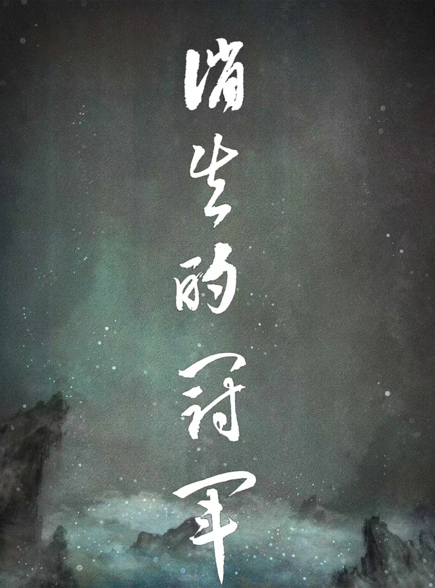

## 消失的冠军

### 祸不单行
自从上次"野心家"案件过去一个月，梅吉总感觉哪里还有些不妥，心理隐隐觉得还有什么地方没有分析清楚。果不其然噩耗传来：某著名演唱者，曾献唱好莱坞颁奖典礼的国际歌星"dodo"小姐在家中因抑郁自杀，送医抢救后已无生命体征。案发地点又是在家中——这一本来应该是我们每个人安乐窝、避风港的地方如今却屡屡成为痛惜案件的频发地点？！不敢相信那个屡屡占据华语乐曲冠军榜的国际歌星，那个以劲歌热舞给人以能量感与积极阳光形象的dodo不为人知的一面居然是个抑郁症患者。那个总说自己爱国的艺人，却最终以放弃自己生命的方式向公众告别。不管媒体如何的多次反转其死因的陈述，都不能让梅总那饱经忧虑的心得到一丝宽慰！！
然而正应了那句古话"福无双至，祸不单行",就在这个事件还未被大众完全消化的时候，我国黑龙家齐齐哈尔市某中学运动馆坍塌事件造成11死5伤的恶性校园事故又成为了视频热搜的头条。11个刚刚夺得中学生联赛亚军的年轻女排姑娘失去了花季样的生命，告别了亲人也告别了他们热爱的也很有可能拿到冠军的排球运动。

看到这些事件不给人喘息机会的接踵而至，梅先生心底被压制的恶魔似乎要复活了！！为了缓解紧张压抑的心情，梅先生决定去看一场电影来缓解极度膨胀的大脑（😄）与生命。经过网络调查发现《消失的她》是一部最近评价及票房均好的电影。于是在一个大雨瓢泼的夏日难得凉爽天他约起了侦探teddy来到了位于小西天的中影总部放映厅观看电影。经过几次的合作他发现teddy这个人头脑灵活、聪明，反应迅速得有些神经质，对一些只看过一眼的事物居然能迅速说出其背后的原因，并经常拿自己开很狠的玩笑对认定的事务却具有极度专注的能力。这点到与梅吉知识丰富、喜欢沉默（思考）、多愁善感神经敏锐总是郁郁不乐对人却又没什么城府的特质形成某种程度的契合与互补。

果然观影的过程如评论描述，多次的剧情反转与烧脑的推理很好的符合了悬疑推理的电影标签。加之俊男靓女的cp搭档，让很多的恋爱男女误以为这是一部恋爱剧而踏入影院，更有甚者在看完了整部电影后，居然有男生顶着发麻的头皮，注视着女友惊恐怀疑的表情跪地求婚（😱）——不得不佩服该男的勇气！！

然而梅先生此时脑中闪过了一个身影，却又将他拉进了对过往的回忆🀄️。虽然侦探催促着梅吉找地方解决午饭，但显然梅吉对脑中的人物的思考却更有胃口。好在冒着渐稀的中雨在距离影院不远的一座杭州包子铺中，二人均找到了符合胃口的食物。侦探要了一屉杭州小笼包、一碗混沌。梅则要了一盘正宗绍兴炒年糕、一碗蛋花汤。看着梅吉逐渐陷入沉思的神情，侦探突然发问道：“你觉得我是个渣男么？”。梅吉瞪大了眼睛，似乎被侦探看穿了心事。看过电影后的男人似乎都会对自己进行一次灵魂的拷问，“我是渣男么？是否我的内心深处也住着电影中男主角样的自己？”为了缓和尴尬的气氛，梅吉半开玩笑的说道：“难道你不是么？不主动、不拒绝、不负责！！！”。侦探眉头微蹙嗔道：“人家母胎单身30年，没交过女朋友好不好？！”看着侦探做小儿女状的滑稽表情。梅吉忙道：“对、对、对你是丢了白马的王子，你找白马姑娘找你！”。侦探被梅先生突如其来的冷幽默逗乐了，刚刚含进嘴里的一口汤水如喷泉般喷薄而出的撒了一桌子，连忙抽出纸巾擦起了桌子。此时的二人看着门外淅沥的雨势和阴沉晦暗的天气，细细的品味着食物的美味和电影带来的心灵感受。又过了一会儿还是侦探先发言了：“你知道我为什么现在还没女朋友么？”。“为啥？别跟我说你是情圣！？”梅先生边说边咀嚼着绍兴年糕，香糯的味道让他想起了童年也想起了一个女人。“你知道么我也是校园霸凌的经历者！”侦探表情做作的说道。“哦！别逗了你什么年代上的学，那会儿哪有什么霸凌，那会儿的孩子都淳朴的嘞！”梅先生诧异的说道。“那里，其实霸凌一直都在，只不过有的人看在眼里而有的人则是记在了心里”。teddy意味深长的说着并开启了他的自顾自的讲述。

### 回忆

“我是八十年代后上的学，应该算是改革开放后前几批长起来的孩子，那时候港台片欧美日本片甚至比现在更多的被搬上了荧幕。而孩子们则从中找到了各自不同的人设。记得我上初中时班里有个女生长得非常的漂亮，白白的皮肤精致的五官，搁在现在绝对是韩国女团里最靓的那个仔。但显然她没有选择走读书学习路线而是走了社会仔的路线，在校园内外有不少的追随者。说到这里可能你以为她就是那个施暴者吧？错了其实严格来说她没有施暴，因为即便她当时给人的感觉很社会但在班里对人却很友好虽然不爱学习，但到了需要交作业或者邻近考试的时候总能见到她笑颜如花的在恳求同学为她行方便，那和蔼客气的劲头像极了现在娱乐休闲节目中看到的那些中韩女优们。而当时的一个班干部准确来说是我们小组 的组长却看不惯她的做派，一次课后他居然不知缘由的扇了女孩一记响亮的耳光，因为突然的情况让我们这些旁观者都惊呆了。现在想起那记耳光似乎仍然能在耳畔听到。当然社会女孩并不会客气也勇敢的回扇了过去，于是就这样两人你来我往的互扇了三四下。只听那个女孩嘴里说道‘你是我什么人？要你管我！！’这件事因为是双方互相动手似乎结局也不了了之了。只是后来那个女孩在中考前就在班里消失了，没有参加中考。至今我仍能回忆起她那年元旦晚会的装扮，雪白的皮肤配上微露前胸的皮夹克，似乎在我们当时那样一群土的掉渣的人群里显得格外的成熟和耀眼。也许她的行为正合了如今有的家长教育孩子的方式：面对侵犯欺凌我们要学会说不并且打回去。这是对自己也是对旁观者最好的交代。但当时对于我这个旁观者来说，固然见到喜欢的女孩被打似乎心里有些难过兼同情，但在当时那样一个以读书学习为唯一出路的年代对女孩表示友好甚至同情却又是我所做不到的，而当时对施暴者（班干部）并没有给予相应的处罚，更让我觉得是老师对班干部的某种认可，现在想来更是一种放纵或者说是漠视（ignorance）

果然后来坏事还是落在了我的头上，原来那个班干部视力不好，为了在即将到来的中考能考个好成绩，他找到老师要求与我换前排的座位，我没有反对的同意了。而心理似乎一直受到这一系列事件的影响成绩也急转直下，模拟考试时政治居然不及格，好在临阵磨枪的补救了过来但影响了整体的复习进度，结果勉强考上了本校的高中。对于这件事情我也没有向家长诉说，所以一直以来家长都认为我心理素质不好遇到大考（事）就紧张从而影响了发挥。
"
此时teddy陷入了沉思，梅先生见他脸上一副落寞悲伤的表情。好奇的问道：”那个女孩后来怎样了呢？“ ”不太清楚，只是听早工作的发小说曾在某家录像厅的夜场见过她和一个男的在一起“见teddy的表情更加的扭曲，梅先生又问道：”你后来呢？“
”我还好，父母对我还是抱有很高的期望的，在他们的鼓励支持下高中三年读的还算顺利，最终考上了二本大学，并在一小单位做了两年程序开发工作，但是也许是我水平的问题没能继续下去，连续换了几家单位后我决定自己干自己喜欢的事情，给自己打工虽然麻烦些但好在图个愿意不是么，而且现在我也基本度过了最难熬的阶段能生存下去我就不图什么房子、车子、票子了！！“

说到这里梅先生看着teddy落寞无奈却又自得自嘲的表情，似乎明白了teddy一直说自己是程序员却一直没见他在那家大厂工作的原因了，幼时霸凌的体验和旧式的思维让他不敢在喜欢的女孩面前表示好感，这样的体验不仅让他失去了以优异成绩（冠军）考入心仪学校的人生赢家体验，更让他在后来的人生道路上面对心仪的工作机会和人生伴侣时屡屡选择不自信（self-denial）的放手。

### 小人物的反击
经过这次的电影消遣之旅梅先生更深入的了解了teddy的为人，并且再次体会到了冷漠对人对社会带来的伤害是如此的持久和巨大，以至于使得国际巨星dodo小姐选择了放弃生命，那11个排球姑娘因为学校施工人员对安全规则的忽视而过早的失去了追求人生目标（冠军）的权力。程序员teddy选择了单身与灵活就业作为了人生的栖居之所与谋生方式。也更让梅吉相信了那句话”也许发生了什么并不可怕，可怕的是我们对所发生的事情做采取的态度“在梅吉与teddy谈话的最后teddy告诉梅，”其实我也并非完全的受害人或者说我是个‘不完美受害人’，因为为我以自己的方式报复了那个组长。“ 

原来在那次中考后teddy与那个组长被分配到高中同班，而就在第一个学期，teddy凭借这初中打下的学习基础拿到了班级第一名并且被年级组选拔进了重点班，工作后的第一年teddy在那个虽然小但是国家编制的单位门口碰到了灰头土脸给人打工的小组长，而这个组长则装做不认识的在他眼前溜走了。

