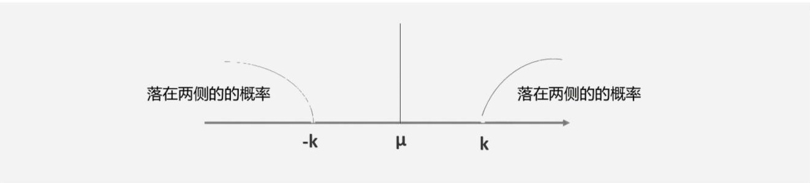

### 五百年前
梅吉晨起跑步，遇一马姓跑友问候之，寒暄后又问另一赵姓跑友为何没见，跑友面色一沉说："他走了"。梅心中一紧，'走了'！莫非.....！!😱。再询问，方知是为了照看大孙子方便，搬去与女儿家一起住了！！🥱虚惊一场。不知从何时起，自己的心理变得如此脆弱，听不得"走了、完了、折了、挂了......"这一系列词语了，而这些都是年轻时时常挂在嘴边的词语"考试折了。老张挂了、谁谁走了"。好像挨过生活揍的人，心也变得知冷暖分轻重的格外珍惜起身边的事和人了？！

认识老赵已经有十年多了，当年的他甚至参加过马拉松比赛。在我们这个业余跑（散）团里可以说是个狠角色，而这些年随着孙子的出生，似乎家里的事情又多了起来，时常看到他早起买饭，送娃，晚上接娃买菜，顺便为家里当全职司机的身影。都说有父母的地方便是家。看到老赵一家其乐融融的样子，梅不禁想起了自己远在浙东山区的老家来，父亲常年在外做生意几乎没管过家里，自己从小和母亲相依为命。但因着自己要强的性格即便是读完初中后因为贫困辍学在家了三年，依旧凭借在外打工的哥哥的资助和自己的扎实的学业刻苦努力的考上了一所国家重点大学的工科专业。当然首先要归功于就读的春晖中学那优良的教育传统，（据说春晖中学是由老家的一位乡绅自费办起的，建立之初请来了朱自清、丰子恺、弘一法师等众多教育名家）学校更是秉持启发性灵式的学习，重在激发学生的学习兴趣，而非照本宣科式的灌输。还有更重要的是家乡得天独厚的地理优势，依山建城（会稽山、3000年建城史），城外水系遍布（曹娥江、新昌江、浦阳江、小舜江、隐潭溪、鉴湖、镜湖、....），仁者乐山智者乐水的山水优势，又加之地处浙东运河与浙东诗路的必经之路上，有着丰富的经济和文化积淀。因此自古以来便名人会聚、传习、修业的地方，远有大禹、勾践、范蠡、西施、王羲之的不朽传说；中有贺知章、元稹、陆游、徐渭、王冕.....的诗剑歌酒花；近有秋瑾、蔡元培、鲁迅、谢晋的文化觉醒与自强。更有像白居易、李白、孟浩然、王阳明、周恩来、陈道明等众多古今名人与这里多有交集。梅吉的心中家乡的人总和家乡的山水风物一样，秀美阴柔，但不失坚忍挺拔。灵动活泛，却又不失规矩传统。古雅温厚得如同曹娥江的水酿出的女儿红。[@LiYongXin2020]

### 中年危机
梅记得当初自己离开家人，进城学习之前。母亲在煤油灯下为自己准备着行李并叮嘱道："儿呀，你去读书要照顾好自己，要说读书妈妈是不担心的，我儿从小就有算命先生说你是文曲星护体，头脑灵的嘞。将来注定是要做学问的哟！可是要到大城市去人那么多，妈妈担心你体力吃不消呀！！你要好好吃饭、好好照顾身体的呀。"想到这里梅先生的眼眶湿润了，眼前又浮起了一层毛玻璃样的东西。在大城市打拼的这些年，果然如母亲所想的。开始时一帆风顺，大学毕业后留校当了老师，自己也按照母亲的形象找到了自己的人生伴侣，结婚生子。但之后渐渐的觉得有些力不从心了，特别是儿子出生后，因为自己没有儿时父亲的记忆，一种焦虑感时刻侵袭过来。为此梅也主动的写信给家里的父母亲，希望能和父亲和解，毕竟他不希望自己小时的经历在儿子身上再现。有时他也想回家去教中学，但是看到眼前这些同他当年一样，从祖国各地为求知而来的莘莘学子们，看到他们那渴望的、淳朴的目光，他又打起了退堂鼓。但是越来越繁重的课程和职称评定任务压得他有时真的喘不过气来了。

偏偏此时儿子却出问题了，原因是儿子学校考试不好，老师让家长在考卷签字。儿子却用拓印的方法模仿（临摹）了梅的笔迹签了字。这让梅很是难受，一方面儿子学习不佳自己确实疏于督促，另一方面梅觉得儿子这代人似乎被电子产品绑架了，似乎缺少人际交往更不提能多走到自然中去享受阳光雨露，好像自己当年在老家一样。好在暑期邻近，梅有了一些思考与处理这些问题的时间。

### 意外收获
在一个暑假热浪滔天的日子里，梅带着儿子在图书馆借到了一本《大卫.科波菲尔》——不知为何梅总觉得英国人有写魔幻小说的传统。然而通过和儿子共读小说。他发现这不是一本魔法小说而是作家狄更斯自传性质的小说——主要讲述了作家童年不幸经历和之后个人成长过程中如何与自我和解、自我奋斗的故事，内容涉及交友、求学、工作、婚姻、旅行等等，这深深引起了梅先生的共鸣。

>“我在世路上是很幸运的，有许多人所费的力气比我更大，而所得的成就却不及我的一半。但是我当时要是没养成谨慎精细、整饬条贯、勤奋黾（音‘闽’）勉的习惯，没养成一时只集中精力于一事的决心，不管接踵而来的另一事有多么紧迫，那我所做的事，就永远也不会那样成功......我这一生里，不论什么，只要是我想要做的，我就全力以赴，务使尽善;不论什么，只要是我从事的，我就全神贯注，不遗余力 ;不论大事，也不论小事，我都勤勤恳恳，毫不假借。**如果一个人想要完全倚靠先天生来或后天学得的才能，而丝毫不借助于质朴诚实、稳定坚忍、勤勉奋发，就想成功，我 从来也不相信那是可能的。这个世界上没有那样而成功的事。.....**”  [@2022]

上面这段话是狄更斯对个人成功的总结，同时书中主人公大卫年轻时为了获得一份议会速记员的工作，拼命练习速记的故事，让他想起了自己当年为了重上高中拼命熬夜补习的日子。而这样的事情如果发生在儿子身上，似乎是不可能的！联想到当下五花八门的补习班、兴趣特长班。梅真有些搞不懂。如今的学习班到底是孩子们的演武场还是们拼爹拼富的大舞台。过去的那些成绩排名刺激、说教式的管理方式也无法适应孩子们快速增长的心理需求，搞不好不是孩子抑郁就是大人受伤（有位家长辅导儿子作业导致心梗离世）

彷徨无措的时候梅又想起了侦探teddy,这次他想有意的难为一下他，看看这位在父母期待下成长起来的程序员到底有怎样的一个认识境界。于是他发出了这样一个请求：

>尊敬的程序员teddy先生您好：请从您的角度谈谈 诚实、稳定、勤奋、之间的关系。如蒙赐教不胜感激。

没过多久程序员发来了他对这一问题的答复。这让梅对teddy的反应敏捷更是佩服之极。

### 切比雪夫
切比雪夫（1821～1894）俄文原名Пафну́тий Льво́вич Чебышёв，俄罗斯数学家、力学家。1821年5月26日生于卡卢加省奥卡托沃，1894年12月8日卒于彼得堡。他一生发表了70多篇科学论文，内容涉及数论、概率论、函数逼近论、积分学等方面。他证明了贝尔特兰公式，自然数列中素数分布的定理，大数定律的一般公式以及中心极限定理。他不仅重视纯数学，而且十分重视数学的应用。

#### 切比雪夫不等式：[@zotero-53]
$$   P(|X-\mu|\ge k)\le  \frac{ \sigma^2}{ k^2 } 或  P(|X-\mu|\lt k)\ge  1 - \frac{ \sigma^2}{ k^2 } \tag{1}$$ 

其中$X   \mu   \sigma^2$ 分别是随机变量、期望和方差并假设它们都存在，对于任意的$k\gt0$上式（1）皆成立。该不等式说明当拥有一组数据期望和方差使，可以通过它对数据中某个存在的数值$K>0$进行概率大小的估算。
$P(|X-\mu|\ge k)$是指X到$\mu$的距离大于k的概率不大于方差与k平方的比值（既概率最大值）;

通俗的说就是$X$离$\mu$越远，则概率越小;$X$离$\mu$越近，则概率越大;$X$大概率会落在$\mu$附近。

比如：假设已知全班的数学考试成绩的平均值为90分，分数的方差为16，那么有多少人超过100分或低于80分？
已知：$\mu=90,\sigma^2=16,k=X-\mu=10$则根据公式（1）有$P(|X-90|\ge 10)\le \frac{16}{ 100}$既：分数超过100分或者低于80分的人所占的比例小于等于16%

我们还可以这样理解这个公式，一场田径比赛中，平时训练成绩3次跑出9.88“的人显然比只有一次跑出9.90”的人更有把握跑进十秒赢得比赛，而这个把握就是根据平时训练度$\sigma^2$相关，这个值越低表明训练效果越好。 那么那个跑进9.90"的人是否在比赛时就没有机会赢了呢？根据（1）式的后半段，只要增加$k$值，在训练度不占优的情况下——判断好跑步当天的天气——天时，熟悉赛场氛围——地利，调整好心态（放松）——人和 制造出一个最接近出好成绩的理想氛围，跑出个人最好成绩的概率是可以和前一位相等甚至超出的。换句话说这需要跑者的极度专注力，————毕竟把比赛当作一次特殊的训练并跑出最好成绩的经验不是人人都会有的！！所以专注的比赛加刻苦的训练就是勤奋。程序员喜欢把这样的过程“迭代”从而提高获得好成绩的可能性$P(|X-\mu|\lt k)$——即稳定性。当然这所有都必须建立在诚实的基础之上。这也是奥运会严格禁止服用兴奋剂的原因。

### 关键参数
梅吉认为除了狄更斯所说的成功特质（稳定、勤奋、诚实）之外，在当下这个时代一个人应同时具备：自然、（社会）人文、科技、心智觉察这四方面的能力。

1. 亲近自然的能力，是现代这些电子傀儡所缺少的，正如自己当年在家乡辍学三年的晨光，下河游泳，捉鱼、钓虾、下田劳作...如果不是这些基本的活动保持了自己一颗纯净的心灵、增强了少年自己的体质。就不能应付后来学业繁重的课程。

2. 社会（人文）的基本交往，让自己对人保留了亲近感，记得当年每个暑期除了帮母亲做基本的家务外，跟着村里一位姓王的先生学习书法是梅先生少年时最闲适快乐的了，从他那里不但听到了许多家乡人物的轶事趣闻还学会了做人做事的基本道理，一笔一画，有规有矩，沉心静气，不急不躁，字如其人。

3. 因为父亲常年不在家，帮助文化水平不高的母亲管理家用，柴米油盐，记账算账是自己的日常行为。让自己养成了一个勤动笔、思考的习惯（计算思维），让自己辍学多年后依然能考上名牌大学的理工专业。

4. 贫困辍学的童年经历，锻炼了自己质朴诚实、稳定坚忍的性格，让自己在随后的岁月中见到苦恼便心无二致、事有不妥便心无杂念——将苦恼当作治病（心智成长）良药，掰开揉碎就水（勇气）吞下。因而对处于困境的人，能够生出细致的觉察与同理同情心。

想到这里梅似乎对孩子的教育有了许多底气，于是在一个暑期酷热的天气里，他用电脑下载了许多书法字帖——欧、颜、柳、赵....让孩子选择喜欢的字体临摹起了大字。看到孩子聚精会神的一笔一划在书写，梅吉在脑海里似乎构想出了孩子未来成才时的样子，心中对电子产品对孩子影响的担心也少了许多，毕竟那只是一个工具，除了打游戏、冲浪我们还能用它做更多的事情：编程简化生活、写博客记录生活、观察生活艺术设计....模拟投资。我们应该始终相信人是电脑的主宰而非奴隶，正如孩子造假签字的事情梅吉同样坚信一种方式用对了地方就是自我修养，用错了可能会悔恨终身。正如梅吉一直坚信的那样“遇到问题不可怕，可怕的是遇到问题后采取什么样的态度....”。毕竟孩子还是可以引导过来的，希望他有朝一日心智成熟时会体会到父亲的用心! 此刻梅的脸上露出了难以察觉的表情。

