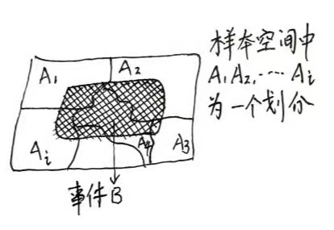

## 谁主沉浮
有人说”我命由我不由天“，有人说”万般皆是命，半点不由人“。毕竟生老病死人之所恶，饮食男女人之所欲。人食五谷，哪有不得病的呢？一旦得病，我们是听天由命还是奋起抗争直至胜利（痊愈）？曾听到过这样一句话”良医不能治无命，强梁岂可与天争“。起初很是纳闷，既然良医都不能起死回生，那么中国历史上那些名医：扁鹊、华佗、孙思邈....的故事是骗人的么？ 那么我们面对厌恶的事情是否就只能束手呢？在经历了个人的疾病折磨后的某一天我突然明白了这句话的含义（自认为），其实这句话是教会我们面对人生一系列不如意的事件所应持有的一个心态。虽然他不能彻底治疗我们身上的疾病，但是它确是我们获得事情转机的一把万能钥匙。

### 故事里的事 [@2022b]
某日清晨，阿尤醒来，忽觉得胸口左上角第三根肋骨处，传来一阵阵若隐若现的针刺感！身体出毛病啦？阿尤猛然想到不久前隔壁部门的同事戴贏在毫无症状的情况下查出肝癌晚期令大家震惊不已的情景。于是阿尤坐卧不宁起来。通过百度后，阿尤越发觉得自己是癌症了！！于是直奔医院，医生听着他的病情描述默默的开出了十张检验单。——推测再有理，不如几张化验单。

阿尤的化验只有两种结果：是癌/非癌。如果非癌则是虚惊一场。可如果是，是否就是世界末日了呢？通常没有经验的人会这样安慰人：“先别伤心，现在检查结果不好，不一定真是癌，有可能结果错了，再换一家检查一下吧”  这样的结果出于好心，却不一定是最好的办法。

我们假定一个情景：某种癌症在某个地区发病率为0.06%，现在某种先进检测方法，患者对这种反应呈阳性的准确率达到98%，不过测试总是不可避免存在误差，不患此癌的人对这种反应也可能阳性，假设概率为1%。

现在，如果一个人的癌症测试结果为阳性，在这样的条件下，他的却得了癌症的概率有多达呢？对于这个问题的计算，我们不得不提概率种两个很重要的定理：全概率公式和贝叶斯公式。

贝叶斯公式的思想是执果索因，就是在知道结果的情况下去推断原因的方法，我们用这种方法通过眼睛看到的现象（结果）去推断事情发生的本质（原因）。而全概率公式则是面对一些较为复杂的概率问题，用一种“化整为零”的思想将它们分解为一些较为容易的情况分别进行考虑的计算方法。

>将样本空间进行划分，计算事件B的概率分解到较为容易的情况进行考虑。全概率公式：$P(B)=\sum_{i=1}^nP(A_i)P(B|A_i)$  贝叶斯公式计算的问题是在知道结果的情况下，推断事件发生的各种可能愿因的概率。贝叶斯公式：$$P(A_i|B)=\cfrac {P(A_i)P(B|A_i)} {\sum_{i=1}^nP(A_i)P(B|A_i)}$$

回到刚才的问题，现在我们假定C表示抽查中患有癌症的人，可见其对立事件$\overline C$代表没有患这种癌症的人。假定A表示试验结果是阳性，已知条件可列举如下：

1. 患癌与不患癌的比例分别如下：
P(C)=0.0006, P($\overline C$)=1-0.0006=0.9994
2. 正常人与癌症患者对比测试的结果：
P(A|C)=0.98, P(A|$\overline C)$)=0.01

计算P(C|A)的概率值需要用贝叶斯公式。计算结果如下：

>$$P(C|A)= \cfrac {P(C)P(A|C)} {P(C)P(A|C)+P(\overline C)P(A|\overline C)} $$
>$$                =\cfrac {0.0006\times0.98}{0.0006\times0.98 +0.9994\times0.01} $$
>$$\approx  0.0556$$
>计算结果表明，在现有的试验条件下，尽管阿尤的试验反应呈阳性，但他是癌症患者的概率只有5.56%。

看到结果，我们会觉得做不做检查没什么差别（0.06%～5.556%）。但实际情况是试验确定癌症的可能性增加了92倍，即100个人中不足6个人的确患癌。对于那些具有癌症高危的人群还需要进一步化验来确诊。这是一次逃出升天或坠入地狱的关键选择，所以重视身体的信号对于阿尤、戴赢和我们所有人都是同样重要的，毕竟死刑与死缓是不一样的？！现代的良医还是能够治疗许多过去我们无能为力的疾病的。当然也需要我们自己的脑子来个小小的转弯。

随着现代计算机大数据、智能化的提高这个公式还应用在模式（语音）识别、垃圾邮件识别、渣男判定（呵呵）等更多的场合

## digest